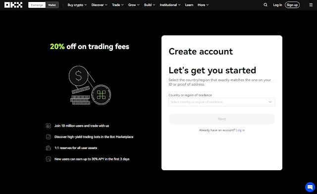
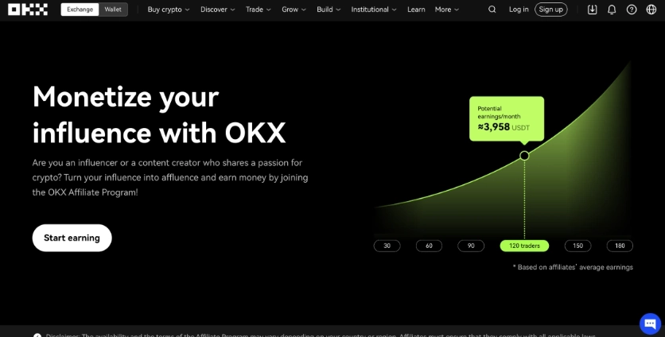

# OKX Referral Code: Get 20% Off Trading Fees

If you're stepping into crypto trading, you're probably already thinking about costs. Trading fees add up fast—especially if you're active. Here's something that might help: OKX lets new users slash their trading fees by 20% just by using a referral code during signup. No complicated steps, no hidden catches. You register, enter the code **47044926**, and the discount automatically applies to every trade you make. Over time, that 20% can mean hundreds or even thousands saved, depending on your trading volume.

---

## What Exactly Is This Referral Code Thing?

So here's how it works. OKX—like most exchanges—wants more users. To get them, they created a referral system. Current users get a unique code, share it with friends or online, and when someone signs up using that code, both people benefit.

For you as a new user, the benefit is simple: lower fees. Specifically, a **20%** reduction on both maker and taker fees. That discount kicks in immediately and applies across spot trading, futures, whatever you're doing on the platform.

The code itself? It's just a string of numbers. In this case: **47044926**. You'll enter it during registration in a field labeled "Referral ID (Optional)"—though honestly, there's no reason to skip it unless you enjoy paying more in fees.

👉 [Want to lock in that 20% discount right now? Click here to register with the code already applied](https://www.okx.com/join/47044926)

OKX tracks everything automatically. Once you're signed up with a referral code, the system logs it, applies your discount, and that's that. You don't need to do anything else.

## How to Actually Use the Code

Alright, let's walk through this step by step. It's pretty straightforward, but I'll break it down anyway.

**Step 1: Head to OKX**  
Go to the OKX website or grab the mobile app. You'll see a "Register" or "Sign Up" button somewhere obvious—click it.

**Step 2: Fill in Your Details**  
They'll ask for the usual stuff: email address, password (make it strong), maybe a username. Nothing out of the ordinary.

**Step 3: Enter the Referral Code**  
This is the important part. Look for a field that says "Referral ID (Optional)" or something similar. Type in **47044926**. Don't skip this step. Seriously. That 20% discount only applies if you enter a code *before* you create your account. You can't add it later.

**Step 4: Agree to Terms and Create Your Account**  
Check the box agreeing to OKX's terms of service (you should probably skim those, by the way), then hit "Create Account" or whatever the button says.

**Step 5: Verify Your Email**  
OKX will send you a verification email. Open it, click the link, and boom—your account is confirmed.

**Step 6: Start Trading**  
Once you're verified, you can deposit funds and start trading. Your 20% fee discount will automatically apply to every transaction. You won't see a separate notification or anything; it'll just be baked into your fee structure.

That's it. Five minutes, maybe less if you type fast.

## Referral Code vs. Affiliate Program: What's the Difference?

Okay, so you might've heard about OKX's "affiliate program" too. Let me clear up the confusion because they're not the same thing.

**The Referral Code** is for regular users—people like you and me. You share your code, someone signs up, you both get benefits. Simple. The perks are usually fee discounts, maybe some bonus tokens or promotions depending on what OKX is running at the time. It's designed for individuals sharing with friends or posting on social media.

**The Affiliate Program** is a whole different beast. It's aimed at influencers, content creators, bloggers, people who can drive serious traffic. If you qualify (and there's an application process), you can earn up to 50% commission on the trading fees generated by people you refer. They give you advanced tracking tools, custom links, all that jazz. It's basically a business opportunity for folks who can move volume.

For most people reading this, the referral code is what you want. It's instant, no approval needed, and the benefits are immediate. The affiliate program is for people thinking about passive income streams and who already have an audience.

## Why OKX, Anyway?

Good question. There are dozens of crypto exchanges out there. What makes OKX worth your time?

First off, scale. OKX serves over 20 million users across 180+ countries. That's not a small operation. They handle massive trading volumes daily, which means liquidity is solid—you're not going to struggle to fill orders at reasonable prices.

Second, they're big on transparency. OKX publishes regular Proof of Reserves reports, showing they maintain a 1:1 reserve ratio. Translation: your funds are actually there. They're not gambling with your deposits or running fractional reserves. In an industry where exchanges have imploded overnight (looking at you, FTX), that kind of transparency matters.

Security-wise, they've got the usual features: two-factor authentication, cold storage for most funds, regular audits. They're also regulated in multiple jurisdictions, which adds another layer of accountability.

As for what you can actually *do* on OKX: pretty much everything. Spot trading, futures, margin trading, staking, DeFi portfolio management, even an NFT marketplace if that's your thing. It's a one-stop shop for most crypto activities.

And the fees? Even without a referral discount, they're competitive. With the 20% off, they're downright attractive.

👉 [Ready to see what OKX offers? Start with 20% off fees using this link](https://www.okx.com/join/47044926)

## Wrapping This Up

Here's the deal: if you're getting into crypto trading, fees are going to eat into your profits. That's just how it works. But why pay more than you have to?

Using referral code **47044926** when you sign up for OKX gets you an instant 20% discount on trading fees. It takes literally 30 seconds to enter during registration, and it could save you a meaningful chunk of money over time—especially if you're an active trader.

OKX itself is a solid platform. Big user base, transparent operations, regulated in multiple markets, and a full suite of trading options. Whether you're buying your first Bitcoin or running complex futures strategies, they've got the tools.

So if you've been on the fence about which exchange to use, this might be the nudge you need. The 20% fee discount is just sitting there waiting for you to claim it.
